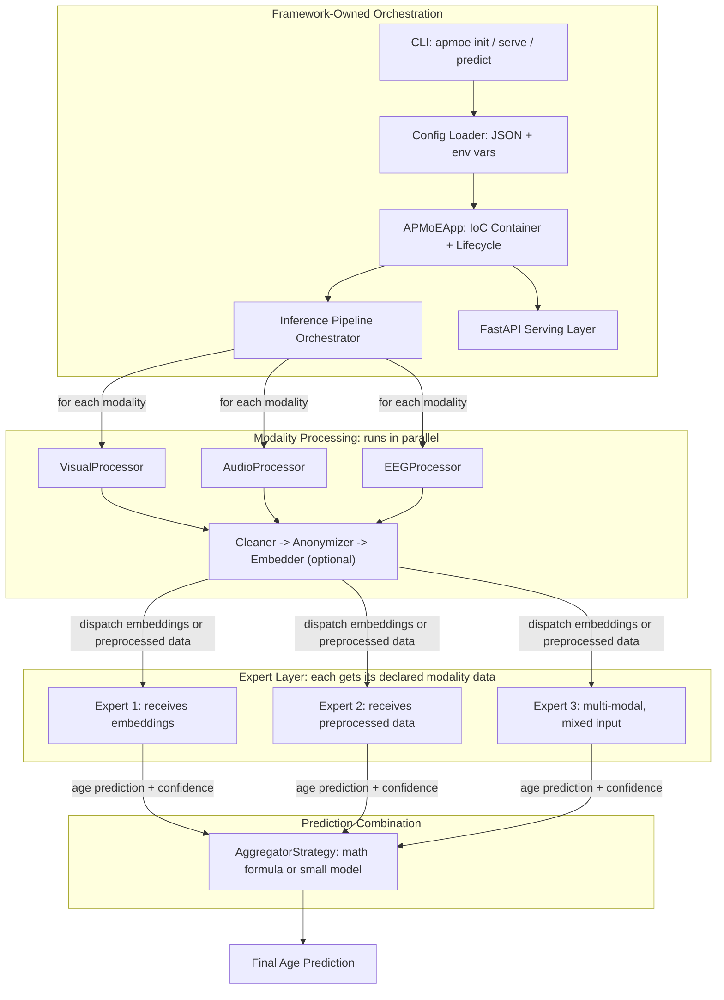

# APMoE Framework Implementation Plan

## Framework vs. Library Distinction

This is a **framework**, not a library. The key architectural principle is **Inversion of Control (Hollywood Principle)**: "Don't call us, we'll call you." Developers extend base classes and register components; the framework owns the execution lifecycle, orchestrates the pipeline, manages configuration, and serves the API. Developers never manually wire components together -- they declare them, and the framework runs them.

## Key Architectural Constraints

1. **No fusion before prediction.** There is no standalone fusion layer that merges all embeddings into a single representation before experts see them. Each expert declares which modalities it consumes (one or more), receives the processed data for those modalities, and produces its own independent age prediction. All predictions are combined *after* inference by an aggregation/combiner layer.
2. **Experts are not restricted to a single modality.** An expert may consume one modality (e.g., only visual) or multiple modalities (e.g., visual + audio). The expert declares its required and optional modalities; the framework dispatches the appropriate processed data to it.
3. **Embedding is optional.** Each modality's processing pipeline always runs `Cleaner -> Anonymizer`, but the `Embedder` step is optional. If an embedder is configured, the expert receives an `EmbeddingResult` (a feature vector). If no embedder is configured, the expert receives the preprocessed `ModalityData` directly (e.g., a cleaned image tensor). This allows experts that perform their own feature extraction to skip the embedding step.
4. **Pretrained models only.** The framework is inference-only. It assumes all expert models arrive pretrained. The framework loads weights, orchestrates the prediction pipeline, and serves results. There is no training loop.

## Architecture Overview

The corrected data flow based on [docs/system-design.md](docs/system-design.md):



The pipeline has two phases. First, all modalities are processed independently in parallel through their `Processor -> Cleaner -> Anonymizer -> (optional) Embedder` chains, producing a map of modality-name to processed output (`EmbeddingResult` if an embedder was configured, or `ModalityData` if not). Then, each expert receives the subset of processed data matching its declared modalities and produces an independent age prediction. Finally, all expert predictions flow into the `Aggregator`, which combines them via a mathematical formula (weighted average, median, etc.) or a small learned combiner model.

## Project Structure

```
apmoe/
  pyproject.toml                    # Package metadata, deps, CLI entry points
  Dockerfile
  docker-compose.yml
  .github/workflows/ci.yml
  configs/default.json              # Default framework config schema
  src/apmoe/
    __init__.py                     # Public API surface
    core/
      app.py                       # APMoEApp: the IoC container, bootstrap, lifecycle
      config.py                    # Pydantic-based config loading + validation
      registry.py                  # Generic component registry (decorator-based)
      pipeline.py                  # Inference pipeline orchestrator
      exceptions.py                # Framework-specific exceptions
      types.py                     # Shared type definitions (ModalityData, Prediction, etc.)
    modality/
      base.py                      # Abstract ModalityProcessor
      factory.py                   # ModalityProcessorFactory (auto-discovers registered processors)
      builtin/
        visual.py                  # Reference visual processor
        audio.py                   # Reference audio processor
        eeg.py                     # Reference EEG processor
    processing/
      base.py                      # Abstract CleanerStrategy, AnonymizerStrategy, EmbedderStrategy
      builtin/
        cleaners.py                # Built-in cleaner implementations
        anonymizers.py             # Built-in anonymizer implementations
        embedders.py               # Built-in embedder implementations
    experts/
      base.py                      # Abstract ExpertPlugin (declares consumed modalities, loads pretrained weights)
      registry.py                  # ExpertRegistry (tracks experts + their modality requirements)
      builtin.py                   # Reference expert implementations
    aggregation/
      base.py                      # Abstract AggregatorStrategy
      builtin.py                   # WeightedAverage, Median, LearnedCombiner, etc.
    serving/
      app_factory.py               # create_api() FastAPI app factory
      routes.py                    # /predict, /health, /info endpoints
      middleware.py                # Auth, rate-limit, request logging, CORS
    cli/
      main.py                      # Click-based CLI: init, serve, predict, validate-config
  tests/
    conftest.py
    unit/                          # Unit tests per module
    integration/                   # End-to-end pipeline tests
  examples/
    quickstart/
      config.json                  # Minimal config using built-in components
      custom_expert.py             # Example of extending the framework
```

Note: The `fusion/` and `routing/` modules from the original plan have been removed. There is no standalone pre-prediction fusion layer. Multi-modal experts handle their own internal combination of the inputs they receive. The `embedder` step is optional per modality -- experts may receive either embeddings or preprocessed data. The MoE "gating" logic (expert weighting) is handled within the `aggregation/` module as part of the combination strategy.

## Phase 1: Core Framework Skeleton

### 1.1 Project Setup and Packaging

- Create `pyproject.toml` with `[build-system]`, `[project]` (name=`apmoe`), dependencies (pydantic, fastapi, uvicorn, click, numpy, torch), optional-dependencies for dev (pytest, ruff, mypy, pre-commit).
- Define CLI entry point: `[project.scripts] apmoe = "apmoe.cli.main:cli"`
- Set up `src/apmoe/__init__.py` as the public API surface exporting key base classes.

### 1.2 Configuration System (`core/config.py`)

- Pydantic `BaseSettings` model for the entire framework config.
- Hierarchical JSON config loaded via stdlib `json`, with environment variable overrides (`APMOE_`-prefixed).
- Sections: `modalities` (each with its own processing pipeline), `experts` (each declaring which modalities it consumes), `aggregation`, `serving`.
- Schema validation with clear error messages on misconfiguration.

Example config shape -- modalities and experts are declared separately; each expert lists the modalities it consumes:

```json
{
  "apmoe": {
    "modalities": [
      {
        "name": "visual",
        "processor": "apmoe.modality.builtin.visual.VisualProcessor",
        "pipeline": {
          "cleaner": "apmoe.processing.builtin.cleaners.ImageCleaner",
          "anonymizer": "apmoe.processing.builtin.anonymizers.FaceAnonymizer",
          "embedder": "apmoe.processing.builtin.embedders.MobileNetEmbedder"
        }
      },
      {
        "name": "audio",
        "processor": "apmoe.modality.builtin.audio.AudioProcessor",
        "pipeline": {
          "cleaner": "apmoe.processing.builtin.cleaners.AudioCleaner",
          "anonymizer": "apmoe.processing.builtin.anonymizers.VoiceAnonymizer"
        }
      }
    ],
    "experts": [
      {
        "name": "face_age_expert",
        "class": "apmoe.experts.builtin.CNNAgeExpert",
        "weights": "./weights/visual_age_expert.pt",
        "modalities": ["visual"]
      },
      {
        "name": "audio_age_expert",
        "class": "apmoe.experts.builtin.MLPAgeExpert",
        "weights": "./weights/audio_age_expert.pt",
        "modalities": ["audio"]
      },
      {
        "name": "multimodal_expert",
        "class": "myproject.experts.MultiModalExpert",
        "weights": "./weights/multimodal_expert.pt",
        "modalities": ["visual", "audio"]
      }
    ],
    "aggregation": {
      "strategy": "apmoe.aggregation.builtin.WeightedAverageAggregator"
    },
    "serving": {
      "host": "0.0.0.0",
      "port": 8000,
      "workers": 4
    }
  }
}
```

### 1.3 Registry and Decorator System (`core/registry.py`)

- Generic `Registry[T]` class that stores name-to-class mappings.
- `@registry.register("name")` decorator for developers to register custom components.
- Auto-discovery: scan registered entry points or specified Python modules.
- Used by every subsystem (modality, processing, experts, aggregation).

### 1.4 Shared Types (`core/types.py`)

- `ModalityData`: dataclass wrapping raw input + metadata (modality type, timestamp, source).
- `EmbeddingResult`: tensor + metadata after embedding step.
- `ProcessedInput = ModalityData | EmbeddingResult`: union type representing the output of a modality's processing pipeline. If an embedder was configured, this is an `EmbeddingResult`; otherwise it is the preprocessed `ModalityData` directly.
- `ExpertOutput`: age prediction + confidence from a single expert, tagged with expert name and consumed modalities.
- `Prediction`: final output (predicted age, confidence interval, per-expert breakdown).

### 1.5 Exception Hierarchy (`core/exceptions.py`)

- `APMoEError` (base), `ConfigurationError`, `RegistryError`, `PipelineError`, `ModalityError`, `ExpertError`, `ServingError`.

### 1.6 Phase 1 Testing and Quality

- Set up `pytest`, `ruff`, `mypy`, and `pre-commit` hooks in `pyproject.toml`.
- Unit tests for `Registry` (register, lookup, duplicate handling, auto-discovery).
- Unit tests for config loading (valid JSON, missing fields, env var overrides, schema validation errors).
- Unit tests for shared types (serialization, validation).
- Docstrings on all public classes and functions in `core/`.

## Phase 2: Extension Point Abstractions

### 2.1 Modality Layer (`modality/base.py`, `modality/factory.py`)

- `ModalityProcessor(ABC)` with abstract methods: `validate(data) -> bool`, `preprocess(data) -> ModalityData`.
- `ModalityProcessorFactory` that resolves processors from config/registry.
- Strategy pattern: each modality type has its own processor.

### 2.2 Processing Pipeline (`processing/base.py`)

- `CleanerStrategy(ABC)`: `clean(data: ModalityData) -> ModalityData`
- `AnonymizerStrategy(ABC)`: `anonymize(data: ModalityData) -> ModalityData`
- `EmbedderStrategy(ABC)`: `embed(data: ModalityData) -> EmbeddingResult`
- Each is swappable per-modality via config.
- The `embedder` field is **optional** in the pipeline config. If omitted, the pipeline output for that modality is the preprocessed `ModalityData` (after clean + anonymize). If present, the output is an `EmbeddingResult`. This allows experts that do their own feature extraction (e.g., a CNN operating on raw image tensors) to receive preprocessed data directly.

### 2.3 Expert Plugins (`experts/base.py`, `experts/registry.py`)

- `ExpertPlugin(ABC)` with:
  - `declared_modalities() -> list[str]` -- class-level declaration of which modalities this expert consumes (e.g., `["visual"]` or `["visual", "audio"]`).
  - `load_weights(path: str)` -- load pretrained model weights (called once at bootstrap).
  - `predict(inputs: dict[str, ProcessedInput]) -> ExpertOutput `-- run inference. Receives a dict keyed by modality name containing the processed data (either `EmbeddingResult` or preprocessed `ModalityData`) for this expert's declared modalities.
  - `get_info() -> dict` -- metadata about the expert (name, consumed modalities, model architecture).
- An expert can consume **one or more modalities**. A single-modality expert receives one processed input; a multi-modal expert receives multiple and is responsible for combining them internally however it sees fit. Each input may be an embedding or preprocessed data depending on whether the modality's pipeline included an embedder.
- `ExpertRegistry`: specialized registry tracking expert instances, their modality requirements, health, and loaded status. At bootstrap, validates that every expert's required modalities are defined in the config.
- Plugin pattern: experts are self-contained, registered, discovered automatically.
- **No training**: experts arrive pretrained; the framework only loads and runs them.

### 2.4 Aggregation (`aggregation/base.py`)

- `AggregatorStrategy(ABC)`: `aggregate(outputs: list[ExpertOutput]) -> Prediction`
- This is where the MoE "gating" lives -- combining multiple expert predictions into one final answer.
- Built-in mathematical combiners: `WeightedAverageAggregator`, `MedianAggregator`, `ConfidenceWeightedAggregator`.
- Built-in learned combiner: `LearnedCombiner` -- a small pretrained model that takes expert predictions + confidences as input and outputs the final prediction. Also loads pretrained weights.

### 2.5 Phase 2 Testing and Quality

- Unit tests for each ABC: verify that concrete subclasses must implement all abstract methods, and that default/hook behavior works.
- Unit tests for `ModalityProcessorFactory` (resolution from registry, missing processor errors).
- Unit tests for `ExpertRegistry` (modality requirement validation, health tracking).
- Docstrings on all abstract methods specifying the contract for implementors.

## Phase 3: Inference Pipeline Orchestrator

### 3.1 Pipeline Engine (`core/pipeline.py`)

- `InferencePipeline` class that runs in two phases:

**Phase A -- Modality Processing (parallel):**

  1. Receives raw multi-modal input (e.g., image + audio + EEG signal).
  2. For each modality independently and in parallel:

     - Routes to the appropriate `ModalityProcessor` via factory.
     - Runs through its `Cleaner -> Anonymizer -> (optional) Embedder` chain.

  1. Produces a `dict[str, ProcessedInput] `mapping modality names to their processed output (either `EmbeddingResult` or preprocessed `ModalityData`).

**Phase B -- Expert Inference + Aggregation:**

  1. For each registered expert, selects the subset of processed data matching the expert's `declared_modalities()` and calls `expert.predict(inputs)`.
  2. Collects all `ExpertOutput`s.
  3. Passes them to the `AggregatorStrategy` for final combination.
  4. Returns `Prediction`.

- Supports both sync and async execution (async for parallel modality branches).
- Graceful degradation: if a modality's input is missing, experts that require only that modality are skipped; multi-modal experts that list it as optional can still run. The result notes which experts were skipped and why.
- Hooks system: `on_before_process`, `on_after_embed`, `on_after_expert`, `on_after_aggregate` for observability/logging.

### 3.2 IoC Container / App Bootstrap (`core/app.py`)

- `APMoEApp` class: the main entry point.
  - `APMoEApp.from_config(path)` -- loads config, resolves all components from registry, loads all pretrained weights, wires the pipeline.
  - `app.predict(inputs)` -- runs the inference pipeline.
  - `app.serve()` -- starts the FastAPI server.
  - `app.validate()` -- validates config, checks all weight files exist, verifies component compatibility.
- This is what makes it a framework: developers configure and extend, they don't orchestrate.

### 3.3 Phase 3 Testing and Quality

- Integration tests for the full pipeline using mock processors and experts with dummy weights.
- Test graceful degradation: missing modality input, failing expert, partial results.
- Test hooks fire in correct order.
- Test `APMoEApp.from_config()` end-to-end with a minimal valid config.
- Docstrings on `InferencePipeline` and `APMoEApp` public methods.

## Phase 4: Serving Layer

### 4.1 FastAPI Application (`serving/app_factory.py`, `serving/routes.py`)

- `create_api(app: APMoEApp) -> FastAPI` factory function.
- Endpoints:
  - `POST /predict` -- multimodal prediction (accepts file uploads per modality).
  - `GET /health` -- readiness/liveness probe (checks all experts are loaded).
  - `GET /info` -- framework version, loaded experts, active modalities, config summary.
- OpenAPI/Swagger auto-generated docs.

### 4.2 Middleware (`serving/middleware.py`)

- Request logging with structured JSON (correlation IDs).
- Rate limiting (configurable via config).
- CORS configuration.
- Authentication hook (abstract, developer-provided).

### 4.3 Phase 4 Testing and Quality

- Unit tests for each endpoint (`/predict`, `/health`, `/info`) using FastAPI `TestClient`.
- Test middleware behavior (rate limiting, CORS headers, request logging).
- Docstrings on route handlers and middleware.

## Phase 5: CLI

### 5.1 CLI Commands (`cli/main.py`)

Using `click`:

- `apmoe init [project-name]` -- scaffold a new project with config template and example custom expert.
- `apmoe serve --config config.json` -- load pretrained models and start the API server.
- `apmoe predict --config config.json --input data/` -- run batch inference on local files.
- `apmoe validate --config config.json` -- validate config, check all weight files exist, verify all components resolve.

### 5.2 Phase 5 Testing and Quality

- Unit tests for each CLI command (init scaffolding, serve startup, predict output, validate error reporting).
- Test CLI with invalid config paths and malformed JSON.
- `--help` output docstrings for every command and option.

## Phase 6: Built-in Reference Implementations

Provide working built-in implementations for every extension point so the framework is usable out of the box. These also serve as reference code for developers writing custom components.

- `modality/builtin/visual.py` -- visual processor (image loading, resizing, normalization).
- `modality/builtin/audio.py` -- audio processor (waveform loading, resampling).
- `modality/builtin/eeg.py` -- EEG signal processor (signal loading, filtering).
- `processing/builtin/cleaners.py` -- standard cleaners per modality type.
- `processing/builtin/anonymizers.py` -- privacy-preserving anonymizers (face blurring, voice perturbation).
- `processing/builtin/embedders.py` -- embedders wrapping pretrained feature extractors (MobileNet, mel-spectrogram, etc.).
- `experts/builtin.py` -- reference expert plugins: single-modality (CNN-based, MLP-based) and a multi-modal example, all loading `.pt` weights.
- `aggregation/builtin.py` -- `WeightedAverageAggregator`, `MedianAggregator`, `ConfidenceWeightedAggregator`, `LearnedCombiner`.

### 6.1 Phase 6 Testing and Quality

- Unit tests for every built-in component (each processor, cleaner, anonymizer, embedder, expert, aggregator).
- Integration test: full end-to-end inference with built-in components and mock pretrained weights.
- Docstrings on all built-in classes explaining usage and configuration options.

## Phase 7: Deployment and CI/CD

- **Dockerfile**: multi-stage build (builder + slim runtime).
- **docker-compose.yml**: framework API service + optional NGINX reverse proxy.
- **GitHub Actions** (`.github/workflows/ci.yml`): lint, type-check, test on push/PR.

## Implementation Order

Work proceeds bottom-up: core abstractions first, then orchestration, then serving/CLI, then built-ins, then deployment. Testing, quality checks (ruff, mypy), and documentation are done within each phase before moving to the next.