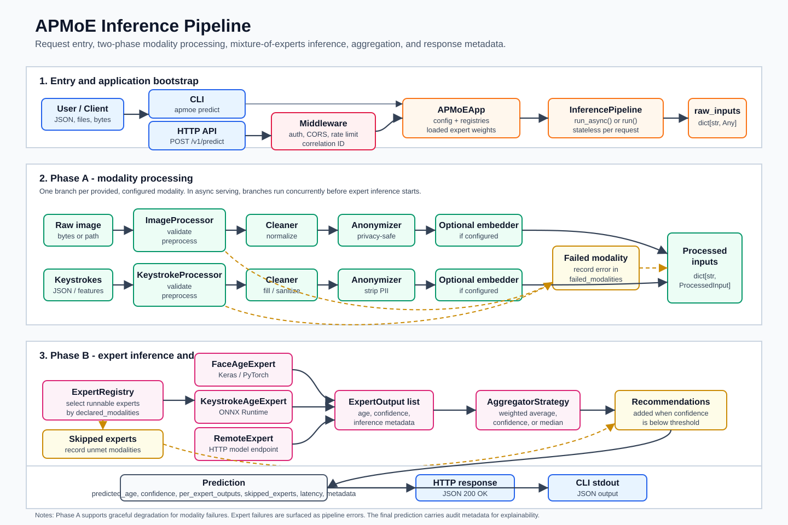

# APMoE Inference Pipeline Diagram

This presentable diagram summarizes the runtime inference path from a CLI or
HTTP request to the final `Prediction` response. It reflects the implemented
two-phase pipeline in `apmoe.core.pipeline`.

## Mermaid Source

```mermaid
flowchart LR
    classDef entry fill:#e8f4ff,stroke:#2563eb,stroke-width:1.5px,color:#0f172a;
    classDef security fill:#fff1f2,stroke:#e11d48,stroke-width:1.5px,color:#0f172a;
    classDef core fill:#fff7ed,stroke:#f97316,stroke-width:1.5px,color:#0f172a;
    classDef phaseA fill:#ecfdf5,stroke:#059669,stroke-width:1.5px,color:#0f172a;
    classDef phaseB fill:#fdf2f8,stroke:#db2777,stroke-width:1.5px,color:#0f172a;
    classDef output fill:#f8fafc,stroke:#475569,stroke-width:1.5px,color:#0f172a;
    classDef warn fill:#fefce8,stroke:#ca8a04,stroke-width:1.5px,color:#0f172a;

    User["User / Client"]:::entry
    CLI["CLI: apmoe predict"]:::entry
    API["FastAPI: POST /v1/predict"]:::entry
    MW["Security middleware<br/>auth, CORS, rate limit,<br/>correlation ID"]:::security
    App["APMoEApp<br/>config + registries + loaded experts"]:::core
    Pipeline["InferencePipeline.run_async()<br/>or run()"]:::core
    Raw["raw_inputs: dict[str, Any]"]:::core

    User --> CLI
    User --> API
    API --> MW
    CLI --> App
    MW --> App
    App --> Pipeline --> Raw

    subgraph PhaseA["Phase A - modality processing"]
        direction TB
        Branches["One branch per provided, configured modality<br/>async path runs branches concurrently"]:::phaseA

        subgraph Image["Image chain"]
            direction LR
            ImgRaw["image bytes / path"]:::phaseA
            ImgProc["ImageProcessor<br/>validate + preprocess"]:::phaseA
            ImgClean["ImageCleaner"]:::phaseA
            ImgAnon["ImageAnonymizer"]:::phaseA
            ImgOut["ProcessedInput<br/>ModalityData or EmbeddingResult"]:::phaseA
            ImgRaw --> ImgProc --> ImgClean --> ImgAnon --> ImgOut
        end

        subgraph Keys["Keystroke chain"]
            direction LR
            KeyRaw["keystroke JSON / features"]:::phaseA
            KeyProc["KeystrokeProcessor<br/>validate + preprocess"]:::phaseA
            KeyClean["KeystrokeCleaner"]:::phaseA
            KeyAnon["KeystrokeAnonymizer"]:::phaseA
            KeyOut["ProcessedInput<br/>ModalityData or EmbeddingResult"]:::phaseA
            KeyRaw --> KeyProc --> KeyClean --> KeyAnon --> KeyOut
        end

        Failed["failed_modalities metadata<br/>bad or missing modality skipped"]:::warn
        Processed["processed: dict[str, ProcessedInput]<br/>only successful modalities"]:::phaseA
    end

    Raw --> Branches
    Branches --> Image
    Branches --> Keys
    Image --> Processed
    Keys --> Processed
    Branches -. validation / processing error .-> Failed
    Failed -. exclude failed modality .-> Processed

    subgraph PhaseB["Phase B - expert inference and consensus"]
        direction TB
        Select["ExpertRegistry selects runnable experts<br/>declared_modalities subset of available modalities"]:::phaseB
        Skipped["skipped_experts metadata<br/>experts needing unavailable modalities"]:::warn
        Face["FaceAgeExpert<br/>Keras / PyTorch"]:::phaseB
        Stroke["KeystrokeAgeExpert<br/>ONNX Runtime"]:::phaseB
        Remote["RemoteExpert / LMStudioExpert<br/>HTTP model endpoint"]:::phaseB
        Outputs["List[ExpertOutput]<br/>age, confidence, metadata"]:::phaseB
        Agg["AggregatorStrategy<br/>weighted average, confidence weighted,<br/>or median"]:::phaseB
        Recs["Below-threshold guidance<br/>recommendations metadata"]:::warn
    end

    Processed --> Select
    Select --> Face --> Outputs
    Select --> Stroke --> Outputs
    Select --> Remote --> Outputs
    Select -. unmet requirements .-> Skipped
    Outputs --> Agg --> Recs
    Skipped -. included in final metadata .-> Recs

    Pred["Prediction<br/>predicted_age, confidence,<br/>per_expert_outputs, skipped_experts,<br/>pipeline_latency_s, metadata"]:::output
    HTTP["HTTP 200 JSON response"]:::entry
    Stdout["CLI JSON stdout"]:::entry

    Recs --> Pred
    Pred --> HTTP
    Pred --> Stdout
```

## Presenter Notes

- The pipeline is stateless per request; expert weights are loaded during app
  bootstrap and reused read-only.
- Phase A degrades gracefully: a failed modality is recorded and excluded, while
  compatible experts can still run.
- Phase B is stricter: expert inference failures are treated as code or runtime
  failures, not silently ignored.
- The returned `Prediction` includes both the final age estimate and audit
  metadata for explainability.

