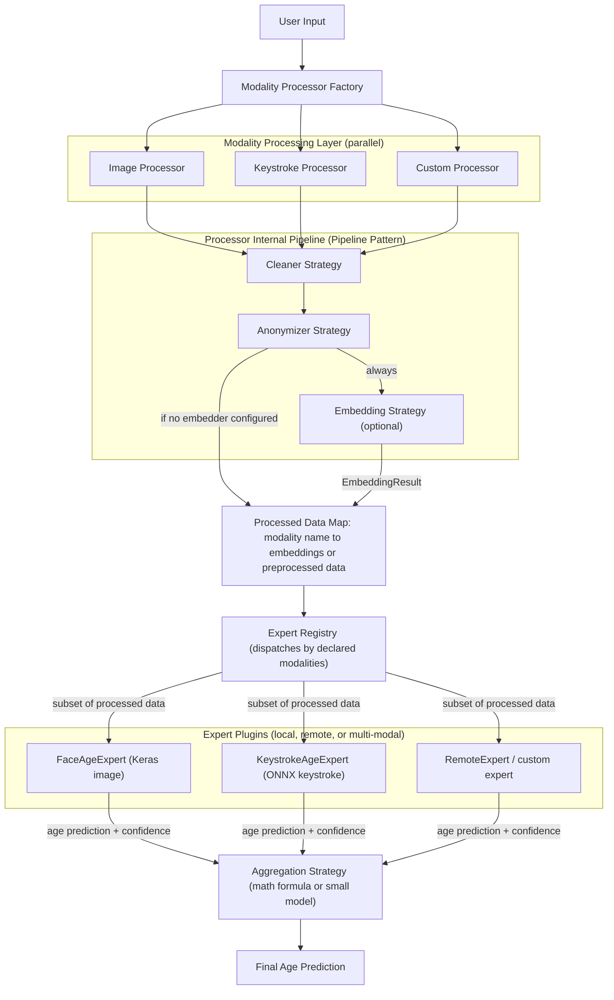

```mermaid
flowchart TB

    %% --- Entry ---
    User["User Input"]

    %% --- Modality Factory ---
    User --> ModalityFactory["Modality Processor Factory"]

    %% --- Modality Processors (Strategy Pattern) ---
    subgraph ModalityLayer ["Modality Processing Layer (parallel)"]
        IProc["Image Processor"]
        KProc["Keystroke Processor"]
        CustomProc["Custom Processor"]
    end

    ModalityFactory --> IProc
    ModalityFactory --> KProc
    ModalityFactory --> CustomProc

    %% --- Internal Pipeline Per Modality ---
    subgraph ProcessorPipeline ["Processor Internal Pipeline (Pipeline Pattern)"]
        Clean["Cleaner Strategy"]
        Anon["Anonymizer Strategy"]
        Embed["Embedding Strategy (optional)"]
    end

    IProc --> Clean
    KProc --> Clean
    CustomProc --> Clean

    Clean --> Anon
    Anon -->|"always"| Embed
    Anon -->|"if no embedder configured"| DataMap

    %% --- Processed Data Map ---
    Embed -->|"EmbeddingResult"| DataMap["Processed Data Map: modality name to embeddings or preprocessed data"]

    %% --- Expert Registry ---
    DataMap --> ExpertRegistry["Expert Registry (dispatches by declared modalities)"]

    %% --- Experts (Plugin Pattern) ---
    subgraph ExpertLayer ["Expert Plugins (local, remote, or multi-modal)"]
        Expert1["FaceAgeExpert (Keras image)"]
        Expert2["KeystrokeAgeExpert (ONNX keystroke)"]
        ExpertN["RemoteExpert / custom expert"]
    end

    ExpertRegistry -->|"subset of processed data"| Expert1
    ExpertRegistry -->|"subset of processed data"| Expert2
    ExpertRegistry -->|"subset of processed data"| ExpertN

    %% --- Aggregation ---
    Expert1 -->|"age prediction + confidence"| Aggregator["Aggregation Strategy (math formula or small model)"]
    Expert2 -->|"age prediction + confidence"| Aggregator
    ExpertN -->|"age prediction + confidence"| Aggregator

    %% --- Final Output ---
    Aggregator --> Output["Final Age Prediction"]
```

