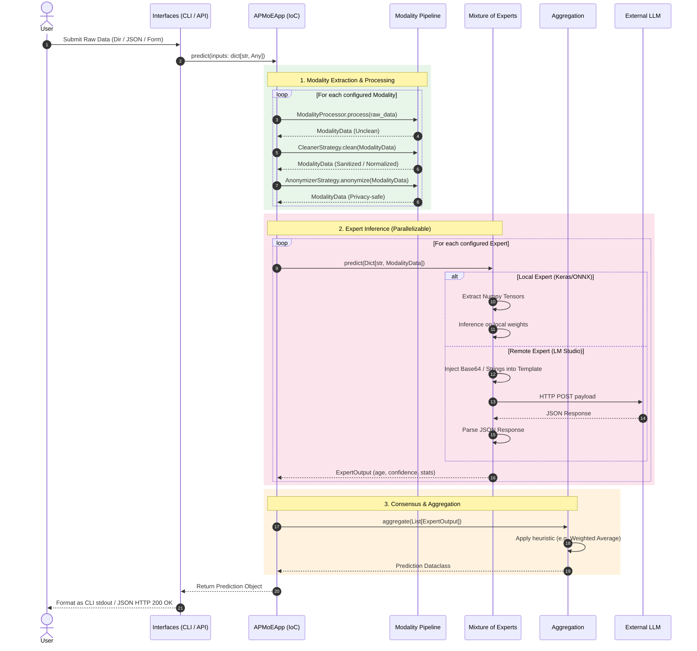

# APMoE Dataflow Design

This document details the lifecycle of data within the Age Prediction Mixture of Experts (APMoE) framework, tracing how raw input from a user transforms into a final age prediction consensus.

## High-Level Data Pipeline

The data lifecycle follows a strict sequence of immutable transformations. At each step, a new state object is created to ensure thread safety and strict auditing.

```mermaid
flowchart LR
    %% Define styles
    classDef input fill:#e1f5fe,stroke:#3182ce,stroke-width:2px;
    classDef process fill:#e8f5e9,stroke:#388e3c,stroke-width:2px;
    classDef inference fill:#fce4ec,stroke:#f57c00,stroke-width:2px;
    classDef output fill:#fff3e0,stroke:#0288d1,stroke-width:2px;

    %% Nodes
    A[Raw Input\nBytes/JSON]:::input
    B[ModalityProcessor]:::process
    C[CleanerStrategy]:::process
    D[AnonymizerStrategy]:::process
    E[Expert Plugins\nLocal/Remote]:::inference
    F[AggregatorStrategy]:::output
    G[Final Prediction]:::output

    %% Flow
    A -- "Parsing" --> B
    B -- "ModalityData" --> C
    C -- "Clean ModalityData" --> D
    D -- "Anonymized ModalityData" --> E
    E -- "List[ExpertOutput]" --> F
    F -- "Consensus" --> G
```

## Detailed Data Lifecycle (Sequence Diagram)

The following sequence diagram maps the internal data structures exchanged across the system boundaries during a standard `apmoe predict` or API call.

## Core Data Structures

To ensure strict decoupling, APMoE passes well-defined Python `dataclass` objects across the boundaries.

### 1. `ModalityData`
The output of the processing pipelines and the input to the experts.
*   **`modality`** (str): The name of the modality (e.g., `"image"`).
*   **`data`** (Any): The payload. Depending on the pipeline, this is usually a `numpy.ndarray` (for local experts) or a `str` (Base64 encoded for remote experts).
*   **`metadata`** (dict): Audit trail metrics like image dimensions, blur intensity applied, or encoding time.

### 2. `ExpertOutput`
The standardized response from any predictor (Local or Remote).
*   **`expert_name`** (str): The identity of the plugin producing the prediction.
*   **`predicted_age`** (float): The estimated age.
*   **`confidence`** (float): A value between `0.0` and `1.0` indicating certainty.
*   **`metadata`** (dict): Inference statistics such as `inference_time_ms`, `input_tokens`, or `backend_engine`.

### 3. `Prediction`
The final state resolved by the Aggregator.
*   **`final_age`** (float): The aggregated consensus age.
*   **`overall_confidence`** (float): The combined confidence score.
*   **`expert_contributions`** (dict): A mapping of which expert provided which answer, for explainability.
*   **`metadata`** (dict): Global metrics.

## Cross-Cutting Concerns: Security & Telemetry
At various boundaries in the dataflow, the **Security Audit Logger** intercepts the data asynchronously to monitor for violations:
*   **Data Validation:** Drops inputs that are too large or malformed before Modality extraction.
*   **Circuit Breaker State:** Monitors connection failures to external APIs during the Expert phase. If error rates exceed thresholds, it short-circuits the dataflow for that specific expert.
