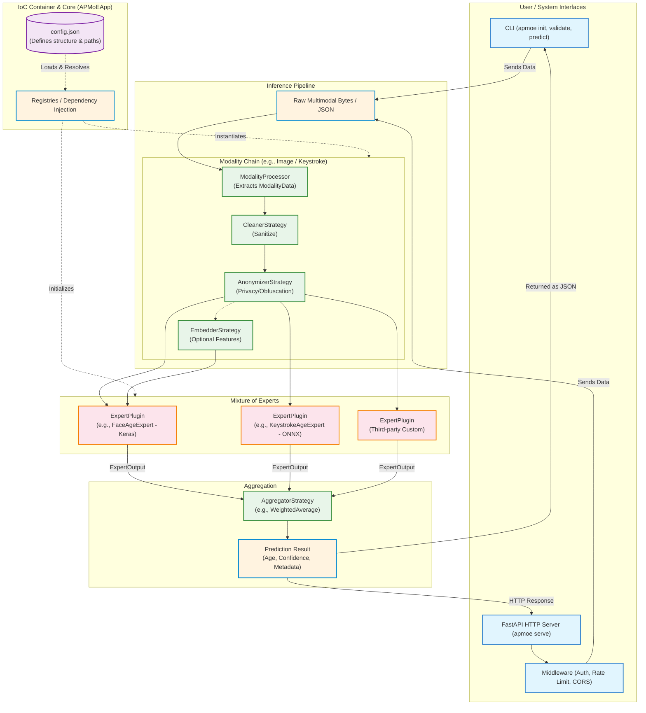

# APMoE System Architecture

This diagram illustrates the core components, data flow, and Inversion of Control (IoC) boundaries of the **Age Prediction Mixture of Experts (APMoE)** framework.

## Layers Overview

1. **Interfaces**: The entry points for using the generic framework. The framework comes with full-featured CLI scaffolding tools and a dynamic FastAPI server equipped with web security middleware.
2. **IoC Container (`APMoEApp`)**: Acts as the brain of the framework. It reads `config.json` via Pydantic and dynamically invokes the specified custom behaviors stored in the Registries without needing hard-coded imports.
3. **Modality Chains**: The data-preparation pipeline segment dynamically generated for each referenced modality (like `image` or `keystroke`). Converts binary inputs into strict `ModalityData` records and passes them through registered Cleaner and Anonymizer algorithms.
4. **Mixture of Experts**: The core predictor plugins. They declare what modalities they require, receive the prepared data (from one or multiple modalities), run their underlying ML logic (e.g. Keras, ONNX, PyTorch), and output decoupled age determinations.
5. **Aggregation**: Gathers the array of disparate predictions and uses configured heuristics (e.g., variance bounds, confidence weights) to compute the final, serialized `Prediction` dataclass sent back to the user interface.