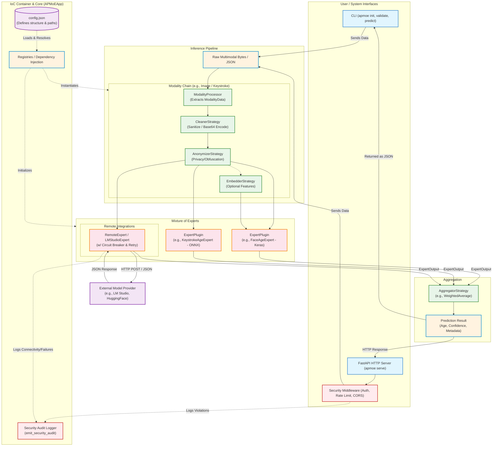

# APMoE System Architecture

This diagram illustrates the core components, data flow, security boundaries, and Inversion of Control (IoC) boundaries of the **Age Prediction Mixture of Experts (APMoE)** framework.

```mermaid
graph TD
    %% Define styles
    classDef interface fill:#e1f5fe,stroke:#3182ce,stroke-width:2px;
    classDef core fill:#fff3e0,stroke:#0288d1,stroke-width:2px;
    classDef pipeline fill:#e8f5e9,stroke:#388e3c,stroke-width:2px;
    classDef expert fill:#fce4ec,stroke:#f57c00,stroke-width:2px;
    classDef external fill:#f3e5f5,stroke:#7b1fa2,stroke-width:2px;
    classDef security fill:#ffebee,stroke:#c62828,stroke-width:2px;

    %% 1. User Interfaces
    subgraph Interfaces ["User / System Interfaces"]
        CLI["CLI (apmoe init, validate, predict)"]:::interface
        API["FastAPI HTTP Server (apmoe serve)"]:::interface
        MW["Security Middleware (Auth, Rate Limit, CORS)"]:::security
        API --> MW
    end

    %% 2. Configuration & Core App
    subgraph AppCore ["IoC Container & Core (APMoEApp)"]
        Config[("config.json\n(Defines structure & paths)")]:::external
        Registries["Registries / Dependency Injection"]:::core
        Audit["Security Audit Logger\n(emit_security_audit)"]:::security
        Config -.->|Loads & Resolves| Registries
    end

    %% 3. Inference Pipeline execution
    subgraph Flow ["Inference Pipeline"]
        RawData["Raw Multimodal Bytes / JSON"]:::core
        
        %% Modality Branch Example
        subgraph ModalityBranch ["Modality Chain (e.g., Image / Keystroke)"]
            Proc["ModalityProcessor\n(Extracts ModalityData)"]:::pipeline
            Clean["CleanerStrategy\n(Sanitize / Base64 Encode)"]:::pipeline
            Anon["AnonymizerStrategy\n(Privacy/Obfuscation)"]:::pipeline
            Embed["EmbedderStrategy\n(Optional Features)"]:::pipeline
            
            Proc --> Clean --> Anon -.-> Embed
        end
        
        RawData --> Proc
    end

    %% 4. Mixture of Experts Component
    subgraph MoE ["Mixture of Experts"]
        Exp1["ExpertPlugin\n(e.g., FaceAgeExpert - Keras)"]:::expert
        Exp2["ExpertPlugin\n(e.g., KeystrokeAgeExpert - ONNX)"]:::expert
        
        subgraph Remote ["Remote Integrations"]
            ExpRemote["RemoteExpert / LMStudioExpert\n(w/ Circuit Breaker & Retry)"]:::expert
        end
    end

    %% External Dependencies
    ExtAPI["External Model Provider\n(e.g., LM Studio, HuggingFace)"]:::external

    %% 5. Aggregation
    subgraph Consensus ["Aggregation"]
        Agg["AggregatorStrategy\n(e.g., WeightedAverage)"]:::pipeline
        Pred["Prediction Result\n(Age, Confidence, Metadata)"]:::core
    end

    %% Wiring everything together
    CLI --> |Sends Data| RawData
    MW --> |Sends Data| RawData
    MW -.-> |Logs Violations| Audit
    
    Registries -.-> |Instantiates| ModalityBranch
    Registries -.-> |Initializes| MoE

    Anon --> Exp1
    Embed --> Exp1
    Anon --> Exp2
    Anon --> ExpRemote

    ExpRemote --> |HTTP POST / JSON| ExtAPI
    ExtAPI --> |JSON Response| ExpRemote
    ExpRemote -.-> |Logs Connectivity/Failures| Audit

    Exp1 -->|ExpertOutput| Agg
    Exp2 -->|ExpertOutput| Agg
    ExpRemote -->|ExpertOutput| Agg
    
    Agg --> Pred
    Pred --> |Returned as JSON| CLI
    Pred --> |HTTP Response| API
```

## Layers Overview

1. **Interfaces & Security**: The entry points for using the generic framework. The framework comes with full-featured CLI scaffolding tools and a dynamic FastAPI server equipped with security middleware. Security events and violations are globally tracked via the centralized `Security Audit Logger`.
2. **IoC Container (`APMoEApp`)**: Acts as the brain of the framework. It reads `config.json` via Pydantic and dynamically invokes the specified custom behaviors stored in the Registries without needing hard-coded imports.
3. **Modality Chains**: The data-preparation pipeline segment dynamically generated for each referenced modality (like `image` or `keystroke`). Converts binary inputs into strict `ModalityData` records and passes them through registered Cleaner and Anonymizer algorithms. For remote LLM integrations, this includes specialized transformations like Base64 encoding.
4. **Mixture of Experts (Local & Remote)**: The core predictor plugins. They declare what modalities they require and receive the prepared data. This layer spans both local machine learning runtimes (e.g. Keras, ONNX, PyTorch) and highly resilient `RemoteExpert` wrappers that delegate inference to external HTTP endpoints, managing retries, circuit breaking, and network security policies.
5. **Aggregation**: Gathers the array of disparate predictions and uses configured heuristics (e.g., variance bounds, confidence weights) to compute the final, serialized `Prediction` dataclass sent back to the user interface.